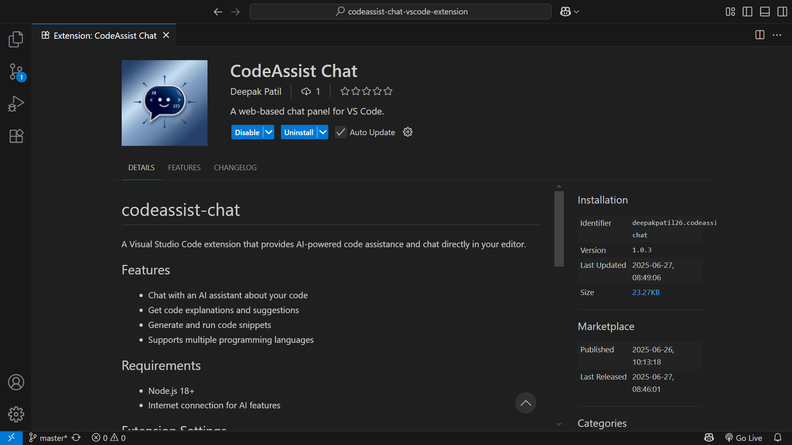

# CodeAssist AI: Your VS Code Pair Programmer

[](https://codeassist-chat-app.vercel.app)



CodeAssist AI is a powerful VS Code extension that brings an intelligent AI pair programmer directly into your editor. It's designed to seamlessly integrate into your workflow, helping you write, refactor, and understand code faster.

_This project is a demonstration of building a full-featured VS Code extension with a modern web-based UI, showcasing a robust client-server architecture._

---

## Core Features

- **Context-Aware Chat:** Use the `@` command to attach files from your workspace directly to the chat, giving the AI the context it needs to provide accurate answers.
- **Inline Code Suggestions:** Get single-line code completions automatically as you type, just like GitHub Copilot. Press `Tab` to accept.
- **Interactive Code Blocks:** Code snippets provided by the AI can be instantly **Copied** to your clipboard or **Inserted** directly into your active editor at the cursor's position.
- **Right-Click Actions:** Simply right-click any file in the editor or explorer and select **Summarize** or **Refactor** to start a new chat with that file as context.
- **Real-Time File Search:** The `@` command provides a real-time, filterable list of all files in your workspace for easy attachment.

## Architecture Overview

This project is composed of two distinct but connected repositories:

1. **The VS Code Extension (This Repo):** The "host" application. It's responsible for all the VS Code API interactions, such as creating the webview panel, handling commands, reading files, providing inline completions, and inserting text into the editor.

2. **The Web App UI (Next.js):** The "client" application. This is a modern React/Next.js app that provides the chat interface. It is rendered inside a **Webview** within the extension and communicates with the extension through a secure message-passing bridge.

```javascript
+------------------------------------------+
|            VS Code Window                |
|                                          |
|  +------------------+  +-----------------+
|  |                  |  |  Webview Panel  |
|  |   Text Editor    |  |  (Iframe)       |
|  |                  |  |                 |
|  +------------------+  | +-------------+ |
|        ^     |       | | Chat UI     | |
|        |     |       | | (React App) | |
|        |     v       | |             | |
|  +------------------+  | +-------------+ |
|  | VS Code Ext Host |  |       ^       | |
|  | (extension.ts)   |  |       |       | |
|  | - File System API|  |       v       | |
|  | - Commands       |  |  Message Bridge | |
|  +------------------+  +-----------------+
|                                          |
+------------------------------------------+
```

## Repositories

- 🟣 **Extension Host:** [codeassist-chat-vscode-extension](https://github.com/deepakpatil26/codeassist-chat-vscode-extension) (You are here)
- 🔵 **Web App UI:** [codeassist-chat-ui](https://github.com/deepakpatil26/codeassist-chat-app)

## Tech Stack

- **Extension:** TypeScript, VS Code API
- **Web App UI:** Next.js, React, TypeScript, Tailwind CSS, ShadCN UI
- **AI Integration:** Genkit (Google AI)

This approach shows not only your coding skills but also your ability to communicate complex technical designs clearly—a very valuable skill.
